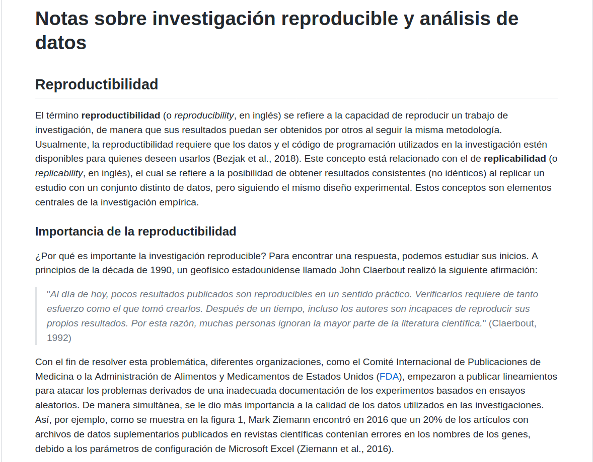

```{r setup, include=FALSE}
knitr::opts_chunk$set(echo = FALSE)

# Learn more about creating websites with Distill at:
# https://rstudio.github.io/distill/website.html

# Learn more about publishing to GitHub Pages at:
# https://rstudio.github.io/distill/publish_website.html#github-pages

```

### Fecha de entrega y entregables
La fecha y hora límite para la entrega de esta tarea es el **jueves 29 de abril de 2021 a las 23:59**.

Debe escribir un documento Markdown en un repositorio en GitHub. Entregue su tarea a través de la plataforma Mediación Virtual, proporcionando el enlace al repositorio GitHub (ej. [https://github.com/mfvargas/notas-investigacion-reproducible]()). El repositorio debe ser público.

La tarea debe realizarse de manera individual.

### Trabajo previo
Se recomienda, además de leer el material presentado en las lecciones, seguir el tutorial [Markdown Tutorial](https://www.markdowntutorial.com/), para familiarizarse con la sintaxis de Markdown.

### Objetivos
Al finalizar esta tarea, el estudiante será capaz de:

1. Crear repositorios y documentos en GitHub.
2. Publicar documentos con sintaxis Markdown en GitHub.


### Desarrollo
En su cuenta en [GitHub](https://github.com/), cree un repositorio llamado ```notas-investigacion-reproducible``` con un archivo llamado ```README.md``` escrito en MarkDown. El documento debe visualizarse igual que en las siguientes figuras. 




Los textos están disponibles en [https://github.com/gf0604-procesamientodatosgeograficos/2021i-tarea-01/blob/main/texto.txt](https://github.com/gf0604-procesamientodatosgeograficos/2021i-tarea-01/blob/main/texto.txt).

### Calificación
Entre paréntesis, se muestra el porcentaje correspondiente a cada aspecto que se calificará:

- (20%) Encabezados.
- (20%) Negritas e itálicas.
- (20%) Citas textuales.
- (20%) Imagen de la figura 1 (el archivo está en [ZiemannEtAlFig1.png](img/ZiemannEtAlFig1.png), puede descargarlo de esa dirección).
- (20%) Hipervínculos (además de los dos de la bibliografía, incluya uno al sitio web de la FDA en https://www.fda.gov/, en donde se mencionan las siglas).
